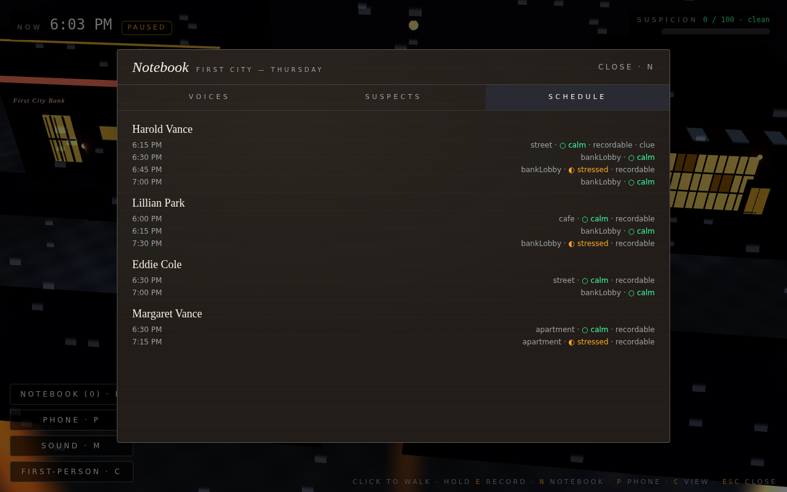
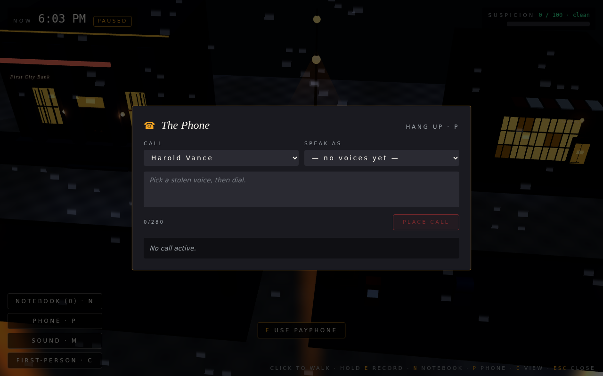

# Voice Thief

A noir heist puzzle where the player has no voice — but everyone else does.

> **Submission for the Zed × ElevenLabs Hackathon — Hack #6.**
> Built in Zed. Powered by ElevenLabs (TTS + Instant Voice Cloning + Conversational AI).


## The pitch

It is 6 PM. The First City Bank vault closes at 7. You have until 9 PM to walk
out with the briefcase. The vault opens only to the manager's voice. So does
the office. So does the front door after closing.

You cannot speak. But you have a tape recorder. And there are people in this
city who do.

## A first-person heist

The game plays in first-person — WASD walk, Shift run, mouse-look, **E** to
interact with whatever's centered in the crosshair. Press **C** to flip into
a top-down "diorama" view if you'd rather plan the heist like a chess board.

### Landing


### Intro cinematic

A 33-second cold open. No tutorial popups; the world tells you what it is.


### The street, in first-person

First City — Main Street at 6 PM. The streetlamps cast amber halos onto the
wet asphalt. The bank's red neon underline glows at the corner. Out on patrol,
the bank guard hums to himself.


The payphone is the player's only outbound line. Pick it up to make a call
in any voice you've stolen.


### The bank facade

First City Bank by night. Stone columns, brass door fittings, two amber
sconces, barred glowing windows, a transom over the door, a red neon strip
under the engraved sign.


### The apartment block

Tenements at the end of the block, fire escape running down the front, lit
windows scattered between dark ones. Margaret Vance's apartment is on the
ground floor.


### Inside the bank

Marble checker floor, brass chandelier, three teller windows with iron bars
behind a long mahogany counter. The secretary's lamp glows on the counter
end. Harold Vance the manager is doing paperwork.


### The vault

Past the manager's hallway, the brass torus frame rings the open vault door.
The deposit-box grid lines the back wall, each box with its keyhole and tiny
glowing number plate. The briefcase sits on its pedestal in the corner.


### Margaret Vance's living room

Maroon walls, picture frames, a sofa under a warm sconce, a window dressed
with curtains looking out at the moonlight. Margaret on the phone gossiping
with the neighbor.


### The all-night cafe

Black-and-cream checker tile, hanging Edison bulbs, espresso machine on the
counter, red-topped stools. The secretary takes her coffee here at 6 PM
sharp.


### Diorama mode (press C)

Same scenes, top-down. Useful for planning, for the demo trailer, and for
anyone who finds first-person uncomfortable.


### The notebook (press N)

Three tabs: **Voices** you've stolen, **Suspects** you've encountered, and
the schedule of recordable moments. Color- and glyph-coded emotion tags
(○ calm · ◐ stressed · ● panicked) so it reads with deuteranopia.



### The phone (press P)

The crime. Pick a target. Pick a stolen voice. Type what you want them to
hear. The receiving NPC reacts in character — and if your performance is
plausible, the world bends around it.



## Controls

| Key | What it does |
| --- | --- |
| **WASD** / arrows | Walk |
| **Shift** | Run |
| Mouse | Look around (FP only — click the canvas to engage pointer-lock) |
| Click ground | Walk to that point (Diorama only) |
| **E** | Interact with what's centered in the crosshair: record an NPC, use the payphone, open a door, authenticate at a voice-locked intercom, take the briefcase |
| **N** | Toggle the Notebook |
| **P** | Toggle the Phone |
| **M** | Mute / unmute audio |
| **C** | Toggle First-person ↔ Diorama view |
| **Esc** | Close any open modal |

## How a heist plays out

There are three valid solution paths to the vault. None of them require
combat or stealth in the traditional sense — only careful timing and good
casting.

1. **Direct.** Record the manager during his calm 6:15 PM cigarette break,
   wait until the bank empties, walk in and play it at the vault.
2. **Diversion.** Record the manager's wife gossiping at home. Call the
   manager from the payphone in her voice. Tell him there's a break-in.
   Watch him flee. Steal his panicked voice on the way out (useful for
   tricking the secretary, not the vault). You'll still need the calm
   cigarette recording for the vault itself.
3. **Insider.** Record the secretary at the cafe at 6:00 PM. Use her voice
   to call the manager about a "lost ledger." He detours to the cafe. You
   record him, calm, in person at the cafe. Then call the secretary in his
   voice and send her on an errand. Bank is empty.

The vault accepts only **calm** voiceprints. A panicked or stressed
recording fails authentication and pings suspicion.

## Local development

```bash
git clone https://github.com/bchuazw/voice_thief.git
cd voice_thief
cp .env.local.example .env.local
# Default mock mode (VT_MOCK_AI=1) lets you play without any API keys.
npm install
npm run dev
# Open http://localhost:3000
```

The placeholder NPC dialogue MP3s ship in `public/audio/npc-scripts/` so the
mock-mode demo works out of the box. To regenerate them with real
ElevenLabs voices:

```bash
# .env.local
VT_MOCK_AI=0
ELEVENLABS_API_KEY=eleven_xxx
ELEVENLABS_VOICE_ID_BANK_MANAGER=...
ELEVENLABS_VOICE_ID_SECRETARY=...
ELEVENLABS_VOICE_ID_BANK_GUARD=...
ELEVENLABS_VOICE_ID_WIFE=...

npm run verify-eleven       # 30s smoke test against the live API
npm run render-scripts      # render all 14 NPC dialogue clips
npm run dev
```

## Tests

The end-to-end suite lives at `vt-e2e.cjs`. Boot the dev server in mock mode
in one terminal and run `node vt-e2e.cjs` in another. **38 / 38 checks pass.**
It exercises every gameplay primitive — phase transitions, recording,
notebook inventory, phone diversion (wife→manager break-in flips the manager
to `rushedHome` and unlocks the hallway), voice auth (stressed fails, calm
passes), briefcase, train-station win, suspicion-driven loss, time-out loss,
and the Solution C secretary→manager pivot — plus 9 direct API contract
checks. Full transcript: [docs/E2E_REPORT.md](./docs/E2E_REPORT.md).

The screenshots above are captured by `vt-fp-shots.cjs` against the running
dev server in mock mode.

## Architecture

See [docs/ARCHITECTURE.md](./docs/ARCHITECTURE.md),
[docs/ELEVENLABS_INTEGRATION.md](./docs/ELEVENLABS_INTEGRATION.md), and
[docs/DEPLOY.md](./docs/DEPLOY.md).

The ElevenLabs API key never reaches the browser — every external call goes
through `app/api/*` route handlers backed by `src/elevenlabs/*` modules
tagged `import "server-only"`. A single `isMockMode()` check short-circuits
all four APIs so the game is fully playable without any keys.

## Accessibility

- Color is never the only channel. Emotion tags carry glyphs (○ ◐ ●).
  Suspicion shows numeric `XX / 100 · clean / noticed / hunted` alongside
  the color bar. Suspicion + recording bars expose proper `role="progressbar"`
  with aria values.
- Recording works via mouse, keyboard, switch, or screen reader: an on-screen
  Record button with `aria-label`, focus ring, and `aria-live` updates plus
  the Hold-E hotkey.
- Every modal is `role="dialog" aria-modal="true"` with an `aria-labelledby`
  heading; **Esc** closes everything.
- Game time auto-pauses while any modal is open so slow readers and
  screen-reader users don't lose real-time. A `paused` badge announces the
  state.
- **M** toggles a global mute that's respected by all synthesized speech
  playback (TTS calls, voice-auth playback, scripted NPC dialogue).
- All HUD label text is at least 11px; transcript captions render alongside
  audio playback.

## Credits

- **Built in:** [Zed](https://zed.dev)
- **Voice AI:** [ElevenLabs](https://elevenlabs.io)
- **3D:** [Three.js](https://threejs.org) + [React Three Fiber](https://r3f.docs.pmnd.rs)
- **Trailer:** [Hyperframes](https://hyperframes.dev)
